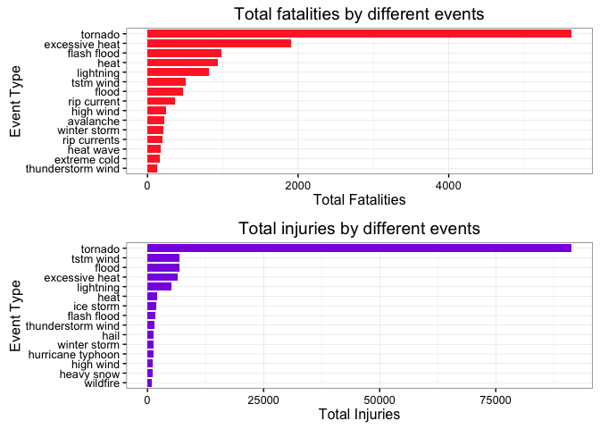
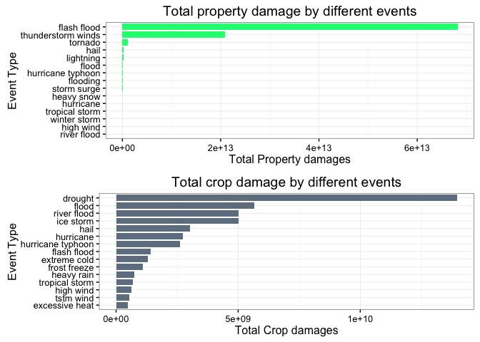

# Health and Economic consequences of Storm and other severe natural calamities in USA

#Synopsis 

Storms and other natural calamities can cause unprecedented damage to property and pose a serious threat to human life. Therefore, preventing such outcomes to the extent possible is a key concern. This project involves exploring the U.S. National Oceanic and Atmospheric Administration's (NOAA) storm database. This database tracks characteristics of major storms and weather events in the United States, including when and where they occur, as well as estimates of any fatalities, injuries, and property damage.

#Data Processing 

The first step is to read the data into a dataframe 

```r
storm <- read.csv(bzfile("repdata-data-StormData.csv.bz2"))
```

Lets check the Event type variable which requires some preprocessing.

```r
length(unique(storm$EVTYPE))
```

```
## [1] 985
```


```r
et <- tolower(storm$EVTYPE)
et <- gsub("[[:blank:][:punct:]+]", " ", et) # Replace punctuation characters with a space.
length(unique(et))
```

```
## [1] 874
```

```r
storm$EVTYPE <- et # Update the event type variable.
```

#Health Impacts due to severe weather events. 
To find the event type which is responsible for the majority of human deaths, the number of fatalities are aggreagted by the event type

```r
library(plyr)
deaths_injuries <- ddply(storm,.(EVTYPE),summarize,fatalities=sum(FATALITIES),injuries=sum(INJURIES))
```

Find the top 15 events that caused the most fatalities and the most injuries

```r
fatal_events <- head(deaths_injuries[order(deaths_injuries$fatalities,decreasing=TRUE),],15)
injury_events <- head(deaths_injuries[order(deaths_injuries$injuries,decreasing=TRUE),],15)
```

Top 15 events that caused the majority of deaths :-

```r
fatal_events[,c("EVTYPE","fatalities")]
```

```
##                EVTYPE fatalities
## 741           tornado       5633
## 116    excessive heat       1903
## 138       flash flood        978
## 240              heat        937
## 410         lightning        816
## 762         tstm wind        504
## 154             flood        470
## 515       rip current        368
## 314         high wind        248
## 19          avalanche        224
## 866      winter storm        206
## 516      rip currents        204
## 242         heat wave        172
## 125      extreme cold        162
## 671 thunderstorm wind        133
```

Top 15 events that caused the majority of injuries :-

```r
injury_events[,c("EVTYPE","injuries")]
```

```
##                EVTYPE injuries
## 741           tornado    91346
## 762         tstm wind     6957
## 154             flood     6789
## 116    excessive heat     6525
## 410         lightning     5230
## 240              heat     2100
## 382         ice storm     1975
## 138       flash flood     1777
## 671 thunderstorm wind     1488
## 209              hail     1361
## 866      winter storm     1321
## 366 hurricane typhoon     1275
## 314         high wind     1137
## 270        heavy snow     1021
## 853          wildfire      911
```

#Economic Impacts due to severe weather events.
To analyze the economic impacts on the property and crops during severe event types first we need to convert the the crop and property damage exponent into equivalent numeric value.

```r
exp_convert <- function(e) {
    # h -> hundred, k -> thousand, m -> million, b -> billion
    if (e %in% c('h', 'H'))
        return(2)
    else if (e %in% c('k', 'K'))
        return(3)
    else if (e %in% c('m', 'M'))
        return(6)
    else if (e %in% c('b', 'B'))
        return(9)
    else if (!is.na(as.numeric(e))) # if a digit
        return(as.numeric(e))
    else if (e %in% c('', '-', '?', '+'))
        return(0)
    else {
        stop("Invalid exponent value.")
    }
}

p <- sapply(storm$PROPDMGEXP,FUN=exp_convert)
storm$prop_dmg <- storm$PROPDMG * (10 ** p)
c <- sapply(storm$CROPDMGEXP, FUN=exp_convert)
storm$crop_dmg <- storm$CROPDMG * (10 ** c)
```

Compute the economic losses by event type.

```r
library(plyr)
eloss <- ddply(storm, .(EVTYPE),summarize,prop_dmg=sum(prop_dmg),crop_dmg=sum(crop_dmg))
eloss <- eloss[(eloss$prop_dmg >0 | eloss$crop_dmg > 0),]
prop_dmg_events <- head(eloss[order(eloss$prop_dmg,decreasing=TRUE),],15)
crop_dmg_events <- head(eloss[order(eloss$crop_dmg,decreasing=TRUE),],15)
```

Top 15 events that caused majority of property damages :-

```r
prop_dmg_events[,c("EVTYPE","prop_dmg")]
```

```
##                 EVTYPE     prop_dmg
## 138        flash flood 6.820237e+13
## 697 thunderstorm winds 2.086532e+13
## 741            tornado 1.078951e+12
## 209               hail 3.157558e+11
## 410          lightning 1.729433e+11
## 154              flood 1.446577e+11
## 366  hurricane typhoon 6.930584e+10
## 166           flooding 5.920826e+10
## 585        storm surge 4.332354e+10
## 270         heavy snow 1.793259e+10
## 357          hurricane 1.186832e+10
## 755     tropical storm 7.703891e+09
## 866       winter storm 6.688597e+09
## 314          high wind 5.270248e+09
## 519        river flood 5.118946e+09
```

Top 15 events that caused majority of crop damages :-

```r
crop_dmg_events[,c("EVTYPE","crop_dmg")]
```

```
##                EVTYPE    crop_dmg
## 84            drought 13972566000
## 154             flood  5661968450
## 519       river flood  5029459000
## 382         ice storm  5022113500
## 209              hail  3025974480
## 357         hurricane  2741910000
## 366 hurricane typhoon  2607872800
## 138       flash flood  1421317100
## 125      extreme cold  1312973000
## 185      frost freeze  1094186000
## 250        heavy rain   733399800
## 755    tropical storm   678346000
## 314         high wind   638571300
## 762         tstm wind   554007350
## 116    excessive heat   492402000
```

#Results 

The following plot shows the top 15 events that caused the most fatalities and injuries due to severe weather events.

```r
library(ggplot2)
```

```
## Warning: package 'ggplot2' was built under R version 3.1.3
```

```r
library(gridExtra)
```

```
## Warning: package 'gridExtra' was built under R version 3.1.3
```

```r
g1 <- ggplot(data=fatal_events,aes(x=reorder(EVTYPE,fatalities),y=fatalities))+geom_bar(stat="identity",fill="firebrick1",width=0.8)+theme_bw()+labs(x="Event Type",y="Total Fatalities",title="Total fatalities by different events")+theme(legend.position="none")+coord_flip()

g2 <- ggplot(data=injury_events,aes(x=reorder(EVTYPE,injuries),y=injuries))+geom_bar(stat="identity",fill="blueviolet",width=0.8)+theme_bw()+labs(x="Event Type",y="Total Injuries",title="Total injuries by different events")+theme(legend.position="none")+coord_flip()
grid.arrange(g1,g2)
```



Thus, from these plots it is clear that tornados are the main reason for the most number of fatalities and injuries.

The following plot shows the top 15 events that caused the most property damages due to severe weather events.

```r
library(ggplot2)
library(gridExtra)
g3 <- ggplot(data=prop_dmg_events,aes(x=reorder(EVTYPE,prop_dmg),y=prop_dmg))+geom_bar(stat="identity",fill="springgreen",width=0.8)+theme_bw()+labs(x="Event Type",y="Total Property damages",title="Total property damage by different events")+theme(legend.position="none")+coord_flip()

g4 <- ggplot(data=crop_dmg_events,aes(x=reorder(EVTYPE,crop_dmg),y=crop_dmg))+geom_bar(stat="identity",fill="slategray",width=0.8)+theme_bw()+labs(x="Event Type",y="Total Crop damages",title="Total crop damage by different events")+theme(legend.position="none")+coord_flip()
grid.arrange(g3,g4)
```



From the plot it is clear that flash flood causes most of the property damages and that drought causes most of the crop damages.
