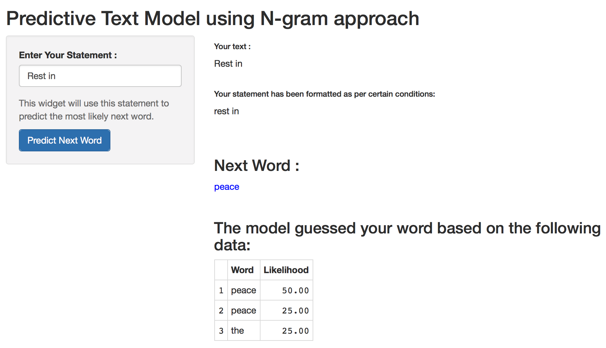

========================================================
author:Samir Yelne
date:Jun 6th, 2016

What is a Predictive Text App?
========================================================

This application is used to predict the next likely word using the previous typed words.

It is built using a predictive text model using an N-Gram approach. Specifically, I have used a trigram model.

The main advantages of using this application are :

* Very useful for typing on mobile devices.
* The app can be used in wide range of activities ranging from banking, to social networking to writing emails etc.
* This app can improve spelling accuracy.

========================================================
## The App Interface

***

The app allows you to enter a word or phrase of words. Once you entered your text it gets reformatted and cleaned appropriately for predicition purposes.

As soon as you click "Predict Next Word" button, the app displays the likely words which you may use in your sentence. 

For example, I typed "Rest in" and the app gave the prediction of next word to be "peace" based on these two words.

How does it work?
========================================================

The app uses the [HC Corpora][1] data set determining word frequency.

* The [HC Corpora][1] is a collection of corpora for various languages freely available to download. The corpora have been collected from numerous different webpages, with the aim of getting a varied and comprehensive corpus. The data set is then categorized into the most frequent word combinations (N-grams).

* Using these N-gram frequencies the app can take the user submitted sentences and quickly calculate the most likely next word.

[1]:http://www.corpora.heliohost.org/index.html

References
========================================================

Working Version of [Predictive Text App][1]

The source [HC Corpora][2] data set and associated [About the Corpora][3].

[1]: https://samiryelne.shinyapps.io/DS_2/
[2]: http://www.corpora.heliohost.org/index.html
[3]: http://www.corpora.heliohost.org/aboutcorpus.html
