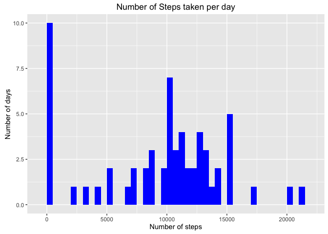
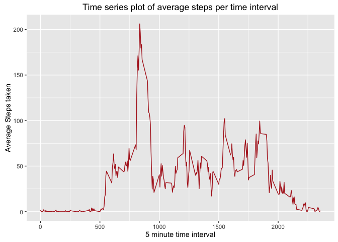
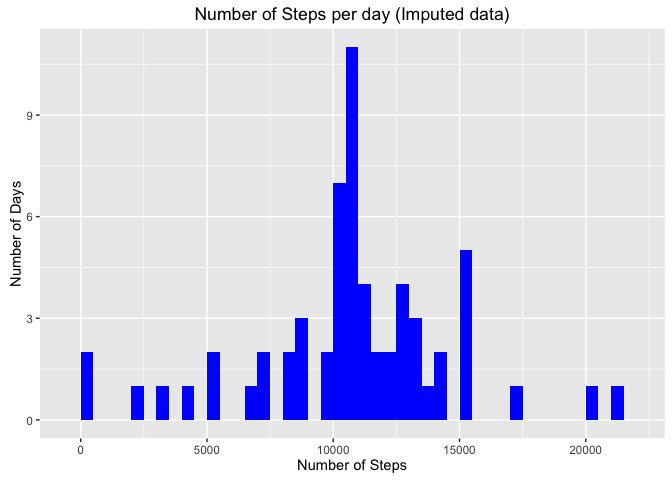
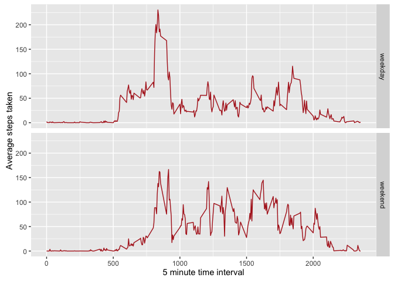

# Reproducible Research Assignment 1 

## Loading and preprocessing the data


```r
ad <- read.csv("activity.csv",sep=",",header=T)  # reads the data 
```

## What is mean total number of steps taken per day ?


```r
library(ggplot2)
```

```
## Warning: package 'ggplot2' was built under R version 3.1.3
```

```r
t <- tapply(ad$steps,ad$date,sum,na.rm=T)
qplot(t,fill=I("blue"),xlab="Number of steps",ylab="Number of days",main="Number of Steps taken per day",binwidth=500)
```



```r
mean(t,na.rm=T)
```

```
## [1] 9354.23
```

```r
median(t,na.rm=T)
```

```
## [1] 10395
```

## What is the average daily activity pattern?


```r
avgsteps_time <- aggregate(x=list(steps=ad$steps), by=list(interval=ad$interval),mean,na.rm=T)
ggplot(data=avgsteps_time, aes(x=interval, y=steps))+geom_line(color="firebrick")+labs(x="5 minute time interval",y="Average Steps taken",title="Time series plot of average steps per time interval")
```



```r
max_steps <- avgsteps_time[which.max(avgsteps_time$steps),]
max_steps
```

```
##     interval    steps
## 104      835 206.1698
```

## Imputing missing values

Finding how many missing values exist in the data

```r
missing <- is.na(ad$steps)
table(missing)
```

```
## missing
## FALSE  TRUE 
## 15264  2304
```
Impute the missing values by using impute function in impute package

```r
ad_all <- ad
Na <- is.na(ad_all$steps)
avg_interval <- tapply(ad_all$steps, ad_all$interval, mean, na.rm=TRUE, simplify=TRUE)
ad_all$steps[Na] <- avg_interval[as.character(ad_all$interval[Na])]
```
Check that there are no missing values


```r
sum(is.na(ad_all$steps))
```

```
## [1] 0
```
Make a Histogram of the total number of steps taken per day on imputed data


```r
imputed_plot <- tapply(ad_all$steps,ad_all$date,sum)
qplot(imputed_plot,fill=I("blue"),binwidth=500)+labs(x="Number of Steps",y="Number of Days",title="Number of Steps per day (Imputed data)")
```



```r
mean(imputed_plot) # Mean of total number of steps per day
```

```
## [1] 10766.19
```

```r
median(imputed_plot) # Median of total number of steps per day
```

```
## [1] 10766.19
```
## Are there differences in activity patterns between weekdays and weekends?


```r
ad_all$day <- ifelse(as.POSIXlt(ad_all$date)$wday %in% c(0,6), 'weekend', 'weekday')
averageactivity <- aggregate(steps~interval+day,data=ad_all,mean)
library(ggplot2)
ggplot(averageactivity,aes(interval,steps))+geom_line(color="firebrick")+facet_grid(day~.)+labs(x="5 minute time interval",y="Average steps taken")
```


